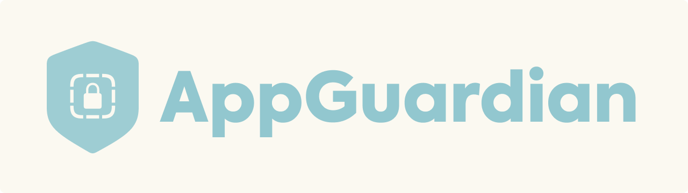

# AppGuardian Admin Panel

This repository contains the source code for the AppGuardian Admin Panel, developed using Aiogram 3.x for Telegram bot integration. AppGuardian is an internal tool designed for a company operating in the GameDev industry, which has a game currently in development with over 1.000.000 downloads.

AppGuardian is used to manage user authorization during the beta testing phase, ensuring that only authorized users can access the app. The admin panel helps administrators to manage users and monitor access.

## Requirements
- Python 3.8
- aiogram 3.12.0
- firebase_admin 6.5.0
- python-dotenv 1.0.1
- httpx 0.27.0
- fastapi 0.112.1
- uvicorn 0.30.6

## Installation
1. Clone repository using the following URL: `https://github.com/matt-novoselov/AppGuardian-Admin-Panel.git`
2. Create Environment File:
   - Create a file named `.env` in the root directory of the source folder.
   - Use the provided `.env.example` file as a template.
3. Replace the placeholder values with your specific configuration:
   - TELEGRAM_TOKEN: Insert your Telegram Bot Token obtained from the [BotFather](https://t.me/botfather).
   - WEBHOOK_DOMAIN: Public SSL domain that will be listening for webhooks request from Telegram.
   - ADMIN_IDS: Telegram IDs of people who have access to the bot. Example: 12345678,87654321,11223344
   - FIREBASE_URL: Firebase connection URL. Example: https://mydatabase-default.us.firebasedatabase.app
   - FIREBASE_SERVICE_ACCOUNT_KEY: JSON file content without line breaks
   - EMAIL_DOMAIN: Domain of your website that will be used to generate email. Example: mydomain.com
4. Build and run `main.py`

 

Distributed under the MIT license. See **LICENSE** for more information.

Developed with ❤️ by Matt Novoselov
